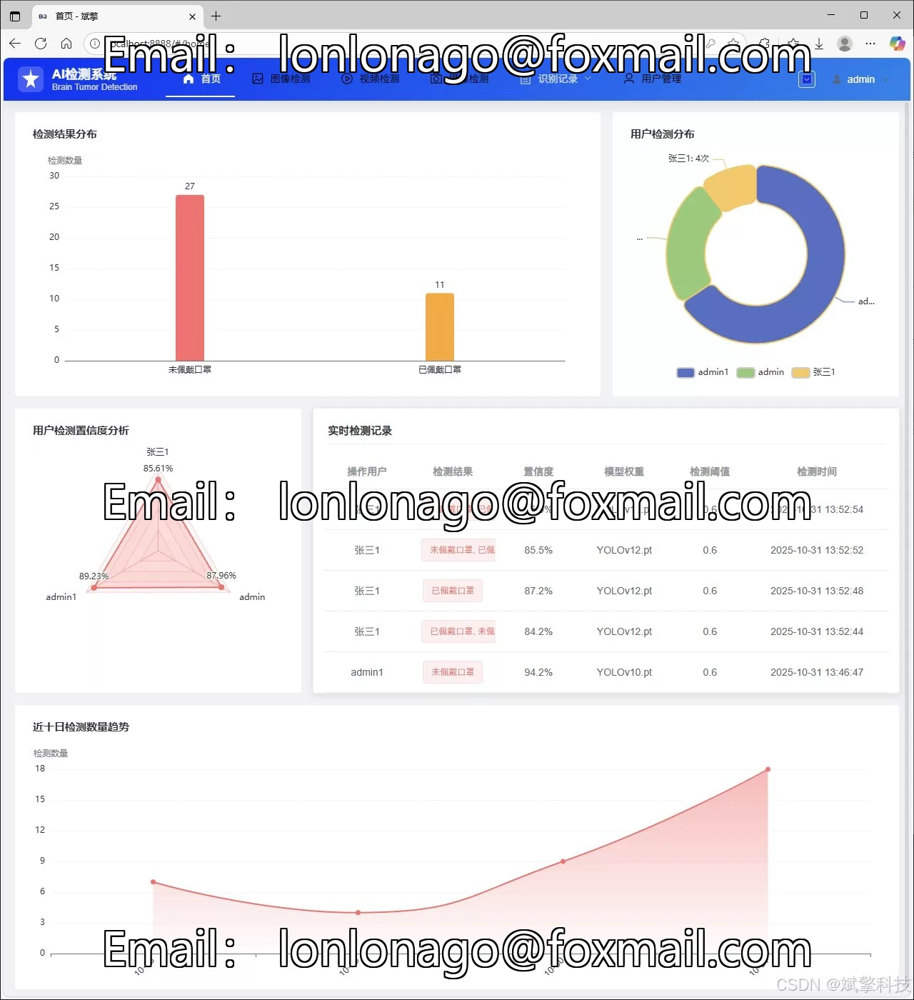
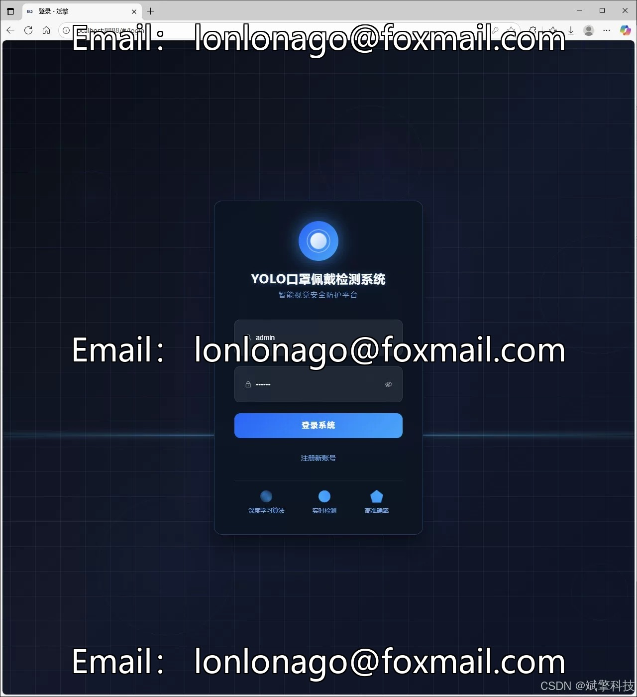
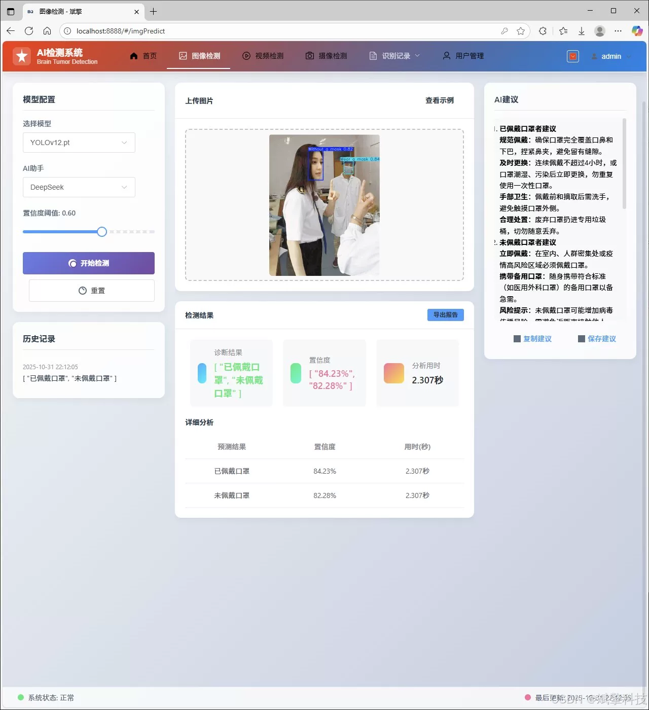
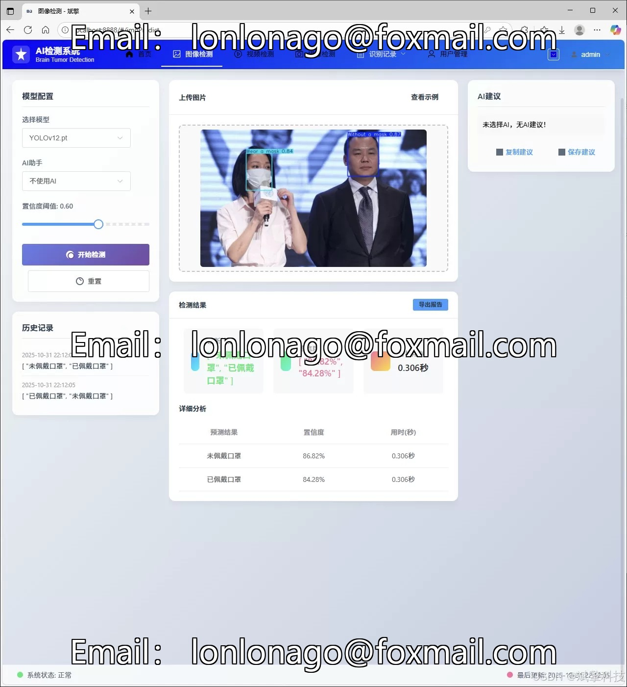
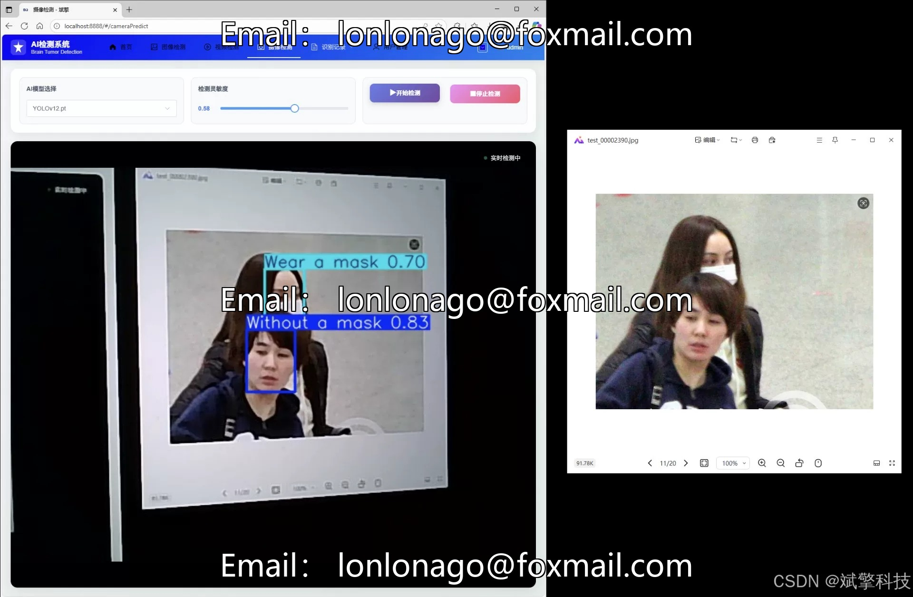
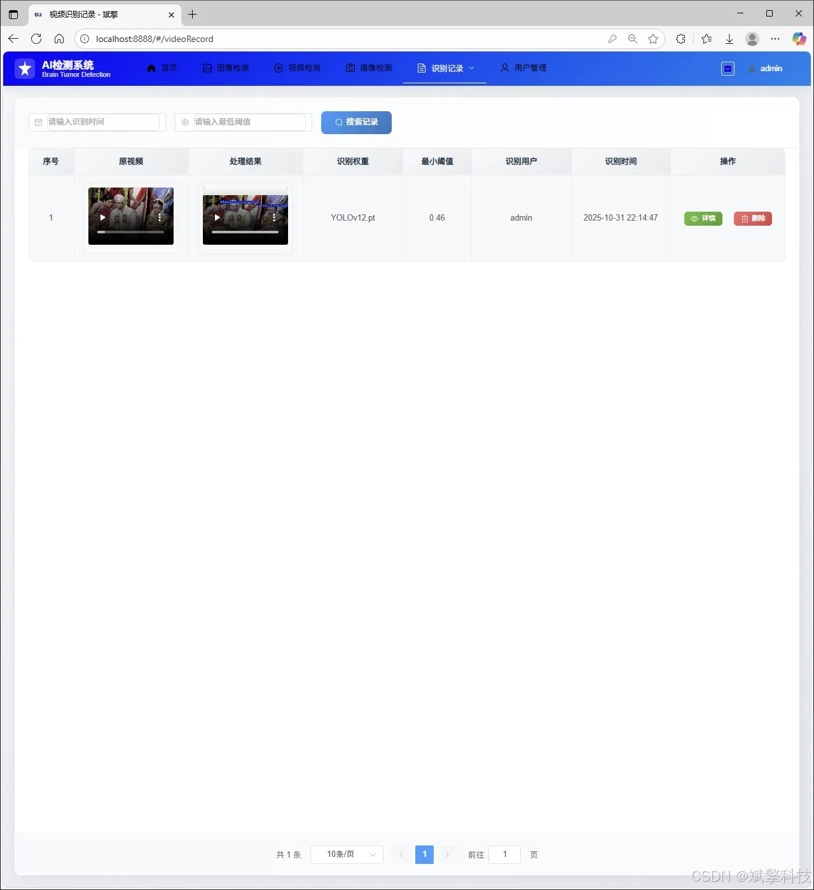
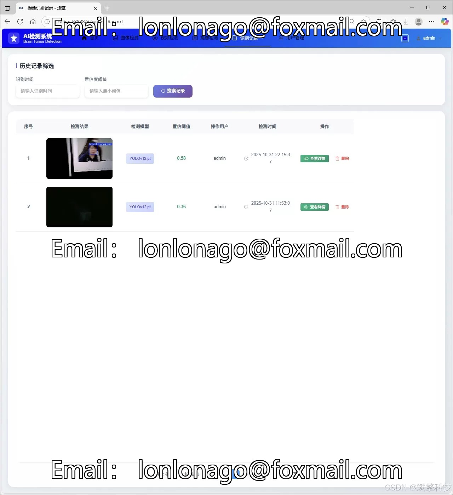
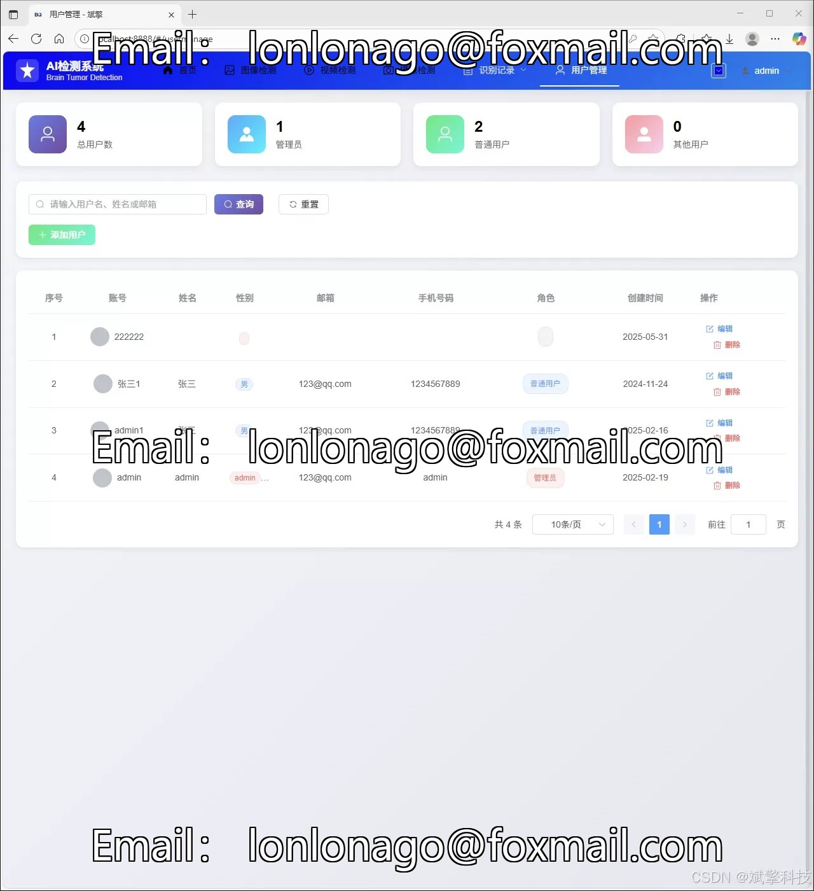
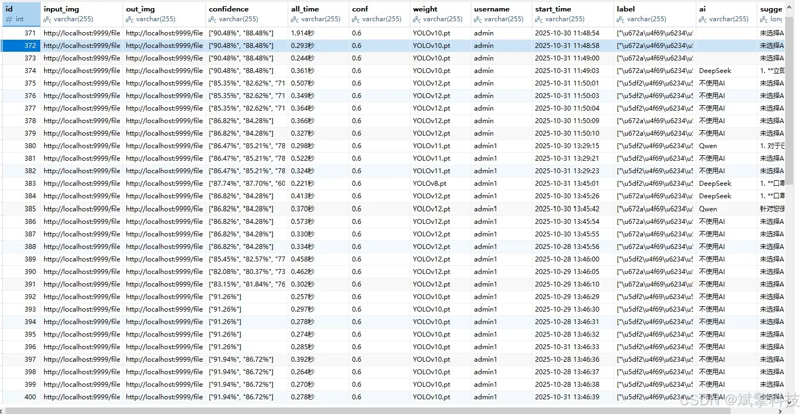

# Based on YOLO deep learning and the large models of Qianwen and DeepSeek, the mask-wearing

## Body

Based on YOLO deep learning and the large models of Qianwen, DeepSeek smart analysis, web interaction interface, front-end separation, YOLO data, YOLOv8/YOLOv10/YOLOv11/YOLOv12.

The system adopts a front-end separation architecture design, using a robust SpringBoot framework to build RESTful APIs at the back end, responsible for core business logic, user management, and AI model scheduling; the front end provides a friendly user interface for data visualization and result display. It is integrated with MySQL database for persistence storage, ensuring the security and manageability of user data, detection records, and model metadata.

The highlight of this system lies in its high flexibility and technological proactivity. It not only supports one-click switching from YOLOv8 to YOLOv12 and other versions of models, allowing users to choose the best model according to different precision and speed requirements, but also innovatively integrates the DeepSeek big language model, providing more intelligent and humanized analysis descriptions for detection results, surpassing traditional simple box selection and classification.

From the perspective of functionality completeness, the system covers the entire process from user login registration, personal center management, to multimedia file (image, video, real-time stream) detection, to detection record management and background user management, and provides rich data visualization dashboards. Meanwhile, personalized UI settings (such as changing the navigation bar color) further enhance the user experience.

Functional modules

✅ Information visualization, data visualization.

✅ Image detection support AI analysis function, deepseek and Qianwen.

✅ Support for image detection, video detection and real-time camera detection, detection results saved to MySQL database.

✅ Image recognition record management, video recognition record management and camera recognition record management.

✅ User management module, administrators can add, delete, modify, and view users.

✅ Personal center, you can modify your information, password name profile picture and so on.

## Images

## Payment

Here is a pay link on Stripe ( https://buy.stripe.com/3cs8yP7sY87d0vu9AB ). Please contact me lonlonago@foxmail.com after funding $89, and I will send you a complete data files , thank you!

